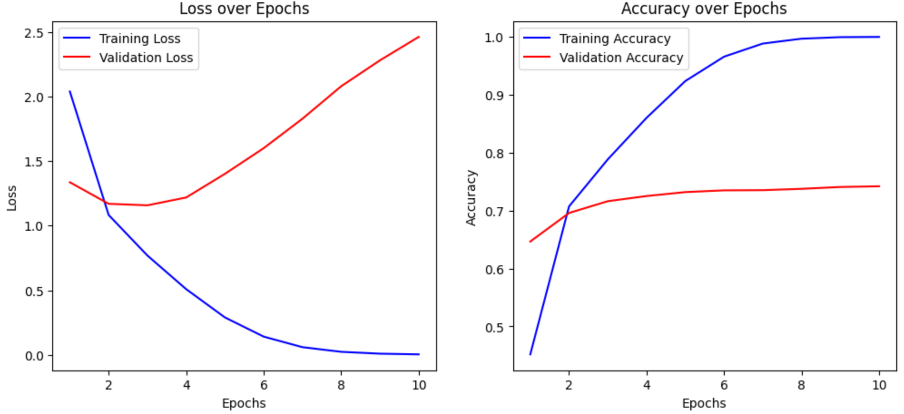
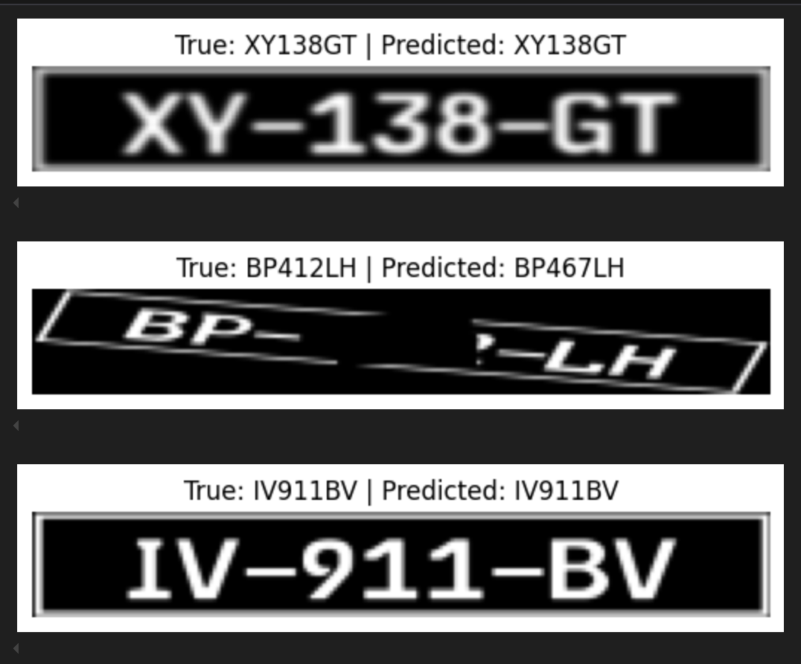

# License Plate Recognition Using Convolutional Neural Network (CNN)

Welcome to the **License Plate Recognition** project! This repository provides an end-to-end solution for training a convolutional neural network (CNN) to recognize license plate characters. The pipeline includes training, validation, and evaluation stages, with data generation for custom license plates and augmentation features. The model is designed to recognize French-style license plates, and can easily be adapted for similar formats.

## Table of Contents
- [Introduction](#introduction)
- [Features](#features)
- [Requirements](#requirements)
- [Installation](#installation)
- [Running the Project](#running-the-project)
- [Scripts Overview](#scripts-overview)
- [Dataset](#dataset)
- [Training](#training)
- [Evaluation](#evaluation)
- [Results](#results)
- [Customization](#customization)
- [Contributing](#contributing)
- [License](#license)

## Introduction
This project aims to automatically generate synthetic license plate images, train a CNN model for character recognition, and evaluate the performance of the trained model. The custom dataset is generated on-the-fly with several augmentation techniques to improve model robustness.

## Features
- **On-The-Fly Dataset Generation**: Generate synthetic license plate images with various augmentations.
- **Customizable CNN Architecture**: Adapt the number of characters and output classes as required.
- **Training and Evaluation Scripts**: Easily train and evaluate the model.
- **Visualization**: Visualize training progress with loss and accuracy curves.

## Requirements
- Python 3.7+
- PyTorch
- torchvision
- tqdm
- Pillow (PIL)
- OpenCV
- Matplotlib

## Installation
1. **Clone the repository**:
   ```bash
   git clone https://github.com/H4ppyS1syphus/TP_Python_3A.git
   cd TP_Python_3A
   ```

2. **Create a virtual environment**:
   ```bash
   python -m venv venv
   source venv/bin/activate  # On Windows, use `venv\Scripts\activate`
   ```

3. **Install the dependencies**:
   ```bash
   pip install -r requirements.txt
   ```

## Running the Project

### Dataset Generation and Pre-Training
To generate the dataset and train the model initially, run:
```bash
python pre_train.py
```

### Training the Model
After pre-training, train the model further using synthetic license plates:
```bash
python train.py
```

### Evaluation
Evaluate the trained model on new license plates:
```bash
python evaluate.py
```

## Scripts Overview

### `pre_train.py`
This script initializes and trains the CNN model using the EMNIST dataset. It uses the **LicensePlateDataset** class to generate training data with characters concatenated horizontally to simulate license plates.

### `train.py`
The main training script where the **OnTheFlyLicensePlateDataset** is used to generate synthetic license plates with augmentations like rotation, noise, and occlusion. The model's weights are saved at the end of training for later use.

### `evaluate.py`
The evaluation script that tests the model on real or synthetic license plates, displaying predictions and the true values for comparison.

### `dataset.py`
Contains the **LicensePlateDataset** and **OnTheFlyLicensePlateDataset** classes for generating training data. Supports various augmentations to simulate realistic conditions, such as brightness, contrast, blur, and perspective transformations.

### `model.py`
Defines the CNN architecture for recognizing license plate characters. The model includes two convolutional layers followed by a fully connected layer that outputs character predictions for the license plate.

## Dataset
The dataset is generated on-the-fly using **Pillow** to create synthetic license plates. Augmentations such as rotation, noise, occlusion, and brightness adjustments are applied to improve the model's generalization capabilities.

The `LicensePlateDataset` class uses EMNIST characters to create synthetic license plates, while the `OnTheFlyLicensePlateDataset` class generates realistic French license plates with different augmentations.

## Training
- The model is trained using **Cross-Entropy Loss** and optimized with **Adam** optimizer.
- During training, **tqdm** is used for progress bars and real-time updates of loss and accuracy.
- Loss and accuracy are logged for each epoch, and training graphs are saved for easy evaluation.



## Evaluation
- The `evaluate.py` script loads the trained model and evaluates it on synthetic and real license plates.
- An additional functionality allows the use of an online image to extract a license plate, preprocess it, and predict the characters.



## Results
- The training process yields satisfactory recognition accuracy for the generated license plates.
- Augmentation techniques enhance the robustness of the model, making it resilient to noise, occlusion, and variations in brightness and contrast.

## Customization
You can customize various parameters:
- **Number of Characters**: Modify `num_chars` in the dataset and model definitions.
- **Augmentations**: Add or modify augmentations in `dataset.py` to suit your needs.
- **CNN Architecture**: Adjust the number of convolutional layers or fully connected layers in `model.py` to improve accuracy.

## Contributing
Feel free to fork this repository, make your own changes, and submit a pull request. Contributions are welcome to improve model accuracy, data generation, and overall project functionality.

## License
This project is licensed under the MIT License.
